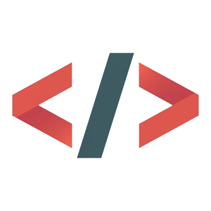
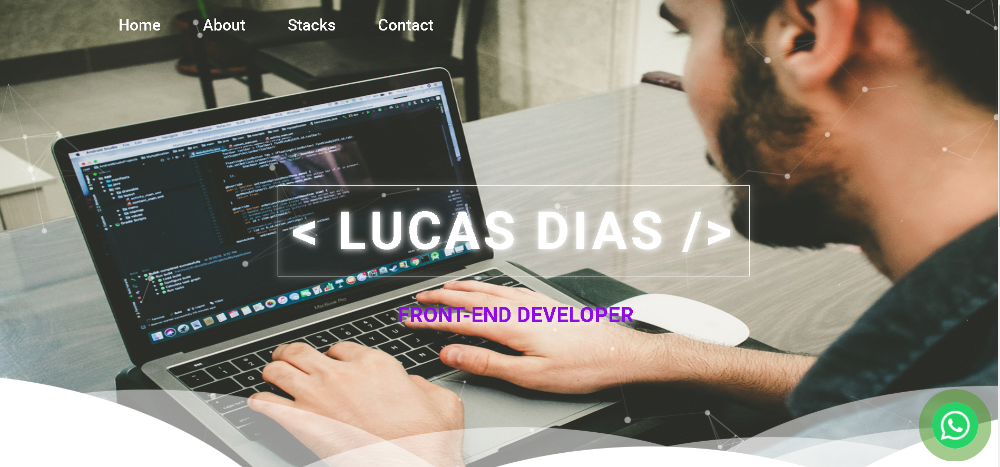

<h1 align="center">
    
</h1>

# Summary

- [Description](#📝-Description)
- [Project](#💻-Project)
- [Technologies](#🚀-Technologies)
- [Project Stats](#🎯-Project-Stats)

---

## 📝 Description

>💻 Personal Portfolio with my personal projects, the main porpuse is to show what i've done recently.

---

## 💻 Project

* <b>Nav bar</b>: Upgrade Nav bar
* <b>Projects</b>: Upgrade Projects hover
* <b>Night mode</b>: Toogle night mode
* <b>Effects</b>: Add effects in texts
* <b>Responsivity</b>: Add and Improve responsivity
* <b>Contacts</b>: Finish contacts 
* <b>Local Storage</b>: Add in local web storage
This project is currently under <b>development.</b>
<h1 align="center">
    
</h1>

---

## 🚀 Technologies
This project was developed with the following technologies:
* VS Code;
* HTML;
* CSS;
* JavaScript.

---

## 🎯 Project Stats

This project is currently under <b>development.</b>

---

## :heavy_check_mark: To do list

* <b>Nav bar</b>: Upgrade Nav bar
* <b>Projects</b>: Upgrade Projects hover
* <b>Night mode</b>: Toogle night mode
* <b>Effects</b>: Add effects in texts
* <b>Responsivity</b>: Add and Improve responsivity
* <b>Contacts</b>: Finish contacts 
* <b>Local Storage</b>: Add in local web storage

---

## :handshake: Become a Contributor

Do you have any ideas that you want to implement it? It's simple!

1. Fork the project
2. Modify what you think is necessary
3. Commit the changes
4. Create a Pull Request

---

## Author

- Projetos - [Lucass2021](https://github.com/Lucass2021)

- Linkedin - [@Lucas Dias da Silva](https://www.linkedin.com/in/lucas-dias-da-silva-118954199/)

- Email - [Lucas Dias](mailto:lucas.allx@hotmail.com")
