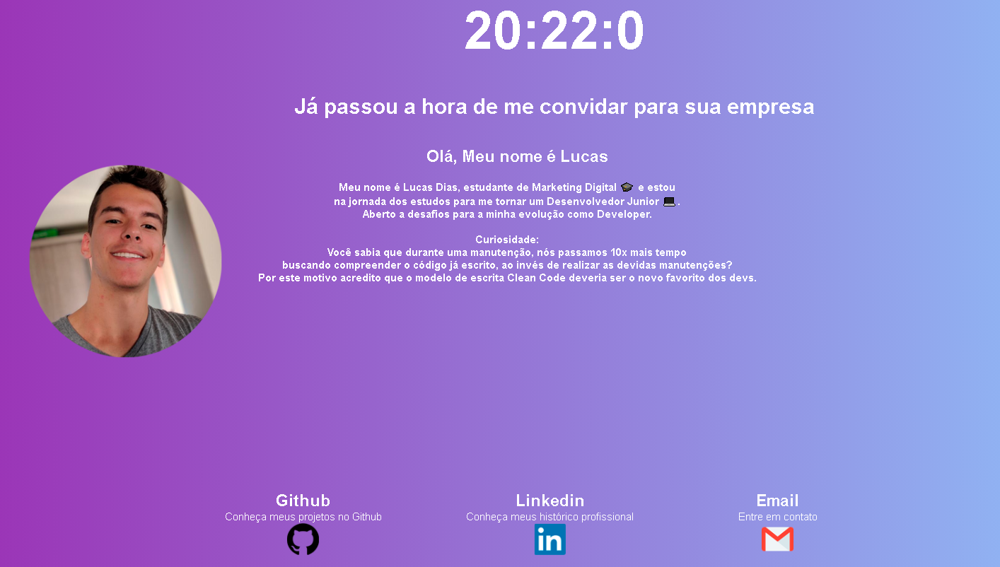

<h1 align="center">
    
</h1>

# Summary

- [Description](#📝-Description)
- [Project](#💻-Project)
- [Technologies](#🚀-Technologies)
- [Project Stats](#🎯-Project-Stats)

---

## 📝 Description

>💻 Personal Portfolio with my personal projects, the main porpuse is to show what i've done recently.

---

## 💻 Project

* <b>Clock</b>: Feature made with basic JavaScript
* <b>Background</b>: Change colors to black and white
* <b>Body</b>: Add body and header content
This project is currently under <b>development.</b>
<h1 align="center">
    
</h1>

---

## 🚀 Technologies
This project was developed with the following technologies:
* VS Code;
* HTML;
* CSS;
* JavaScript.

---

## 🎯 Project Stats

This project is currently under <b>development.</b>

---

## :heavy_check_mark: To do list

- Add Projects
- Add Header
- Add Body Content
- Add Design Formatation (UX)

---

## :handshake: Become a Contributor

Do you have any ideas that you want to implement it? It's simple!

1. Fork the project
2. Modify what you think is necessary
3. Commit the changes
4. Create a Pull Request

---

## Author

- Projetos - [Lucass2021](https://github.com/Lucass2021)

- Linkedin - [@Lucas Dias da Silva](https://www.linkedin.com/in/lucas-dias-da-silva-118954199/)

- Email - [Lucas Dias](mailto:lucas.allx@hotmail.com")
